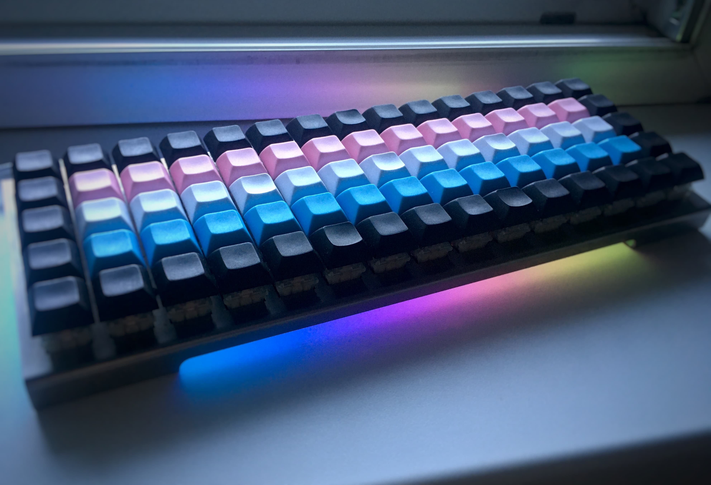
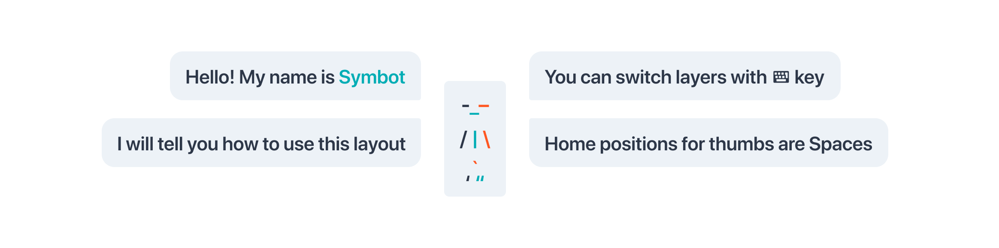
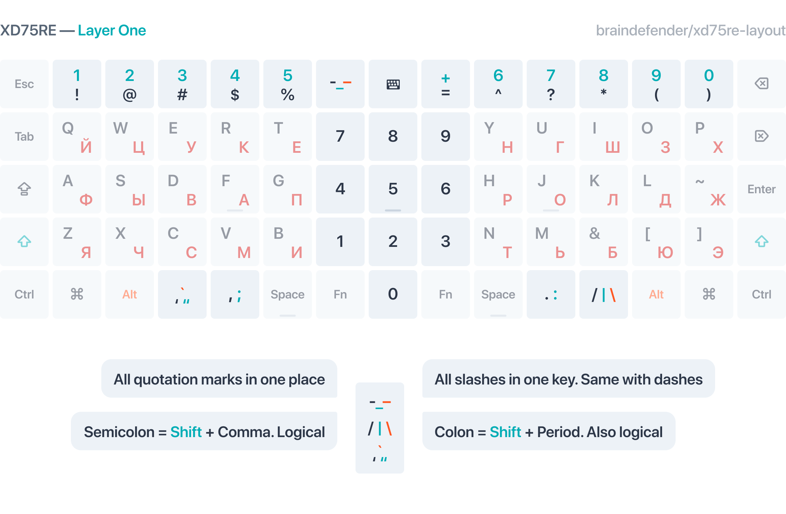
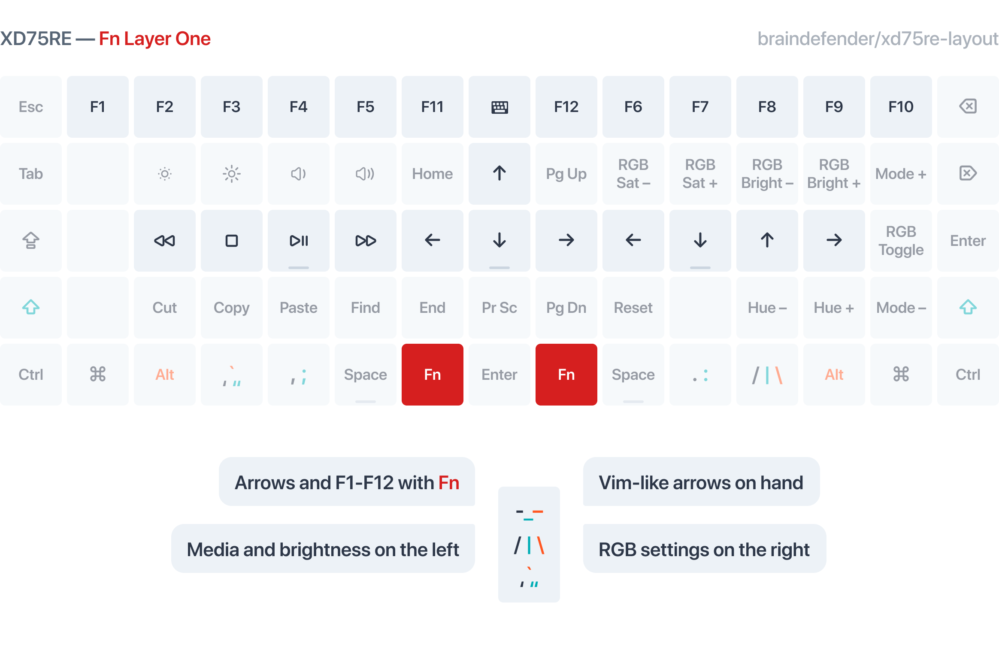
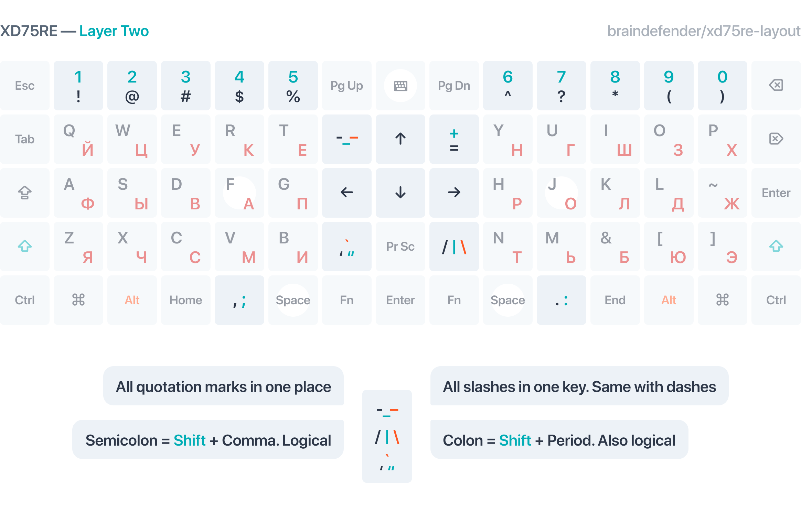
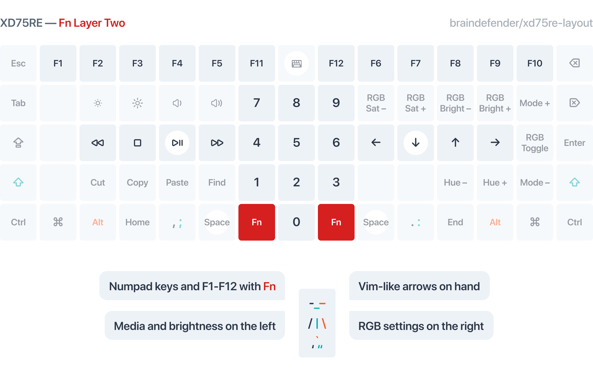
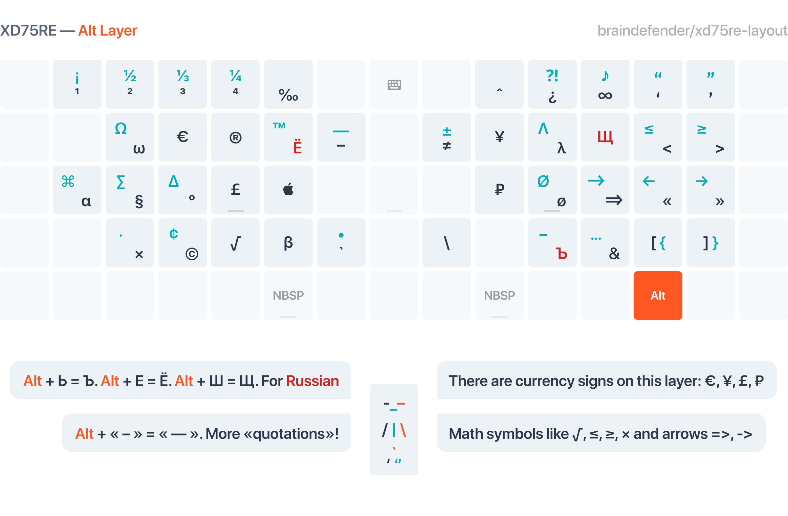

# XD75RE Universal Layout

Keyboard layout for [XD75RE](https://kprepublic.com/products/xd75re-xd75am-xd75-xiudi-60-custom-keyboard-pcb) ortholinear mechanical keyboard.

I had been using [Universal Layout](https://github.com/braindefender/universal-layout) for years now 
and wanted to push the limit of my keyboard experience with ortholinear XD75RE.

The main purpose of Universal Layout was logical arrangement of similar symbols (e.g. <kbd>'</kbd>, <kbd>"</kbd>, <kbd>\`</kbd>) in one place
and preserving positions of symbols in both English and Russian layouts.

In this layout I combined the main advantages of Universal Layout and spice it up with new features like vim arrows, numpad-switching and media controls.

You will be guided through this article by the mascot of Universal Layout — Symbot!

**Key differences from traditional layout:**

- Keyboard split into three parts with Numpad/Arrow block in center.
- Keys with <kbd>,;</kbd> and <kbd>.:</kbd> are placed separately from both sides of <kbd>Space</kbd>.
- All common symbols are gathered in one key. Such as quotes, slashes and dashes.
- Numeric row has been swapped with symbols: to type number use <kbd>Shift</kbd> + symbol, e.g. <kbd>Shift</kbd> + <kbd>@</kbd> = <kbd>2</kbd>.

## Layer One

## Layer Two

This layer are similar to Layer One, but Numpad is placed on Fn Layer. 
Quotes and slashes are moved closer to the center of keyboard.
I personally like vim arrows and media shortcuts in the Fn Layer. 

## Alt Layer

Alt Layer contains some symbols for currency, math, arrows and rare letters. 
Keys that combine similar symbols (like quotes and slashes) are also powered by this layer.

**🇷🇺 For Russian layout users:**

- Символы <kbd>Ё</kbd>, <kbd>Щ</kbd> и <kbd>Ъ</kbd> помещены на Alt Layer и практически не вызывают проблем в наборе.  
- С помощью этого слоя всегда можно ввести символы <kbd>[</kbd>, <kbd>]</kbd>, <kbd>{</kbd> и <kbd>}</kbd>. 

## Installation

1. Copy `.dll` from `sources` folder to `C:/Windows/System 32`.
2. Run `.reg` files and reboot the system (or logout / login).
3. Select layout in `Preferences / Language and Region / Language`.

## Known issues

For some reason Windows 10 occasionally changes layout back to default English or Russian layout.

To prevent this behaviour you could rename `HKLM\SYSTEM\CurrentControlSet\Control\Keyboard Layouts` 
registry entry named `00000409` and `00000419` to something else (e.g `00000409` → `00000409-off`).

But it is a temporary fix and may break keyboard behaviour in some applications. Full impact is unknown and not tested by me.

## Tools

- Layout design: [Figma](https://www.figma.com), [kbdasm](https://github.com/grompe/kbdasm) and [KbdEdit](http://www.kbdedit.com).
- Firmware: [QMK Configurator](https://config.qmk.fm/#/xd75/LAYOUT_ortho_5x15) to create and [QMK Toolbox](https://github.com/qmk/qmk_toolbox) to flash firmware.

